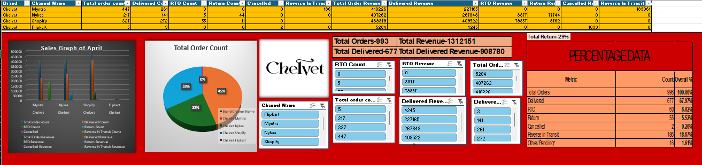
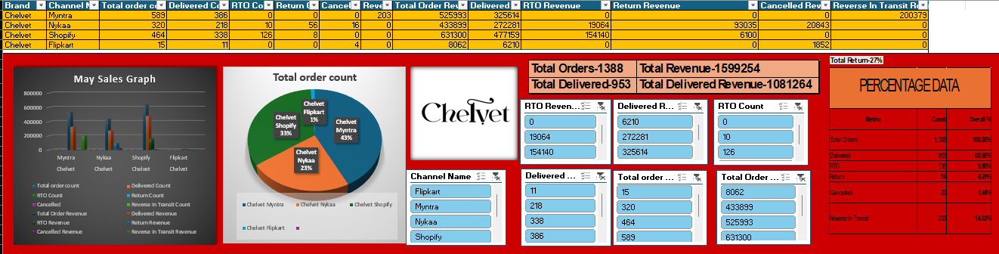

# 📊 E-Commerce Sales Dashboard (Excel)

An interactive **E-Commerce Sales Dashboard** built in **Microsoft Excel** to analyze and compare sales performance across multiple online marketplaces. This project provides actionable business insights through dynamic dashboards, KPIs, Pivot Tables, Charts, and Slicers.

---

## 📌 Project Overview

The dashboard is designed to transform raw sales data into meaningful business insights. It enables users to monitor sales performance, compare monthly trends, evaluate key metrics, and support data-driven decision-making.

The project analyzes sales data for **April** and **May**, covering multiple e-commerce platforms such as **Myntra, Nykaa, Shopify, and Flipkart**.

---

## 🎯 Objectives

- Analyze monthly sales performance.
- Compare sales across different e-commerce platforms.
- Monitor important business KPIs.
- Identify sales trends and growth opportunities.
- Build an interactive and user-friendly Excel dashboard.
- Present business insights using data visualization.

---

## 🛠️ Tools & Technologies

- Microsoft Excel
- Pivot Tables
- Pivot Charts
- Slicers
- Conditional Formatting
- Excel Formulas
- Data Validation
- KPI Cards
- Interactive Dashboard Design

---

## 📈 Key Performance Indicators (KPIs)

- 📦 Total Orders
- 🚚 Delivered Orders
- 💰 Total Revenue
- 💵 Delivered Revenue
- ❌ Return Count
- 🔄 RTO Count
- 🚫 Cancelled Orders
- 📊 Return Percentage
- 📈 Platform-wise Sales Performance

---

## ✨ Dashboard Features

- Interactive Slicers
- Monthly Sales Comparison (April vs May)
- Marketplace-wise Performance Analysis
- Revenue Tracking
- Order Status Monitoring
- KPI Summary Cards
- Dynamic Charts
- Professional Dashboard Layout

---

## 📂 Project Structure

```text
ECommerceSalesDashboard/
│── README.md
│── ECommerceSalesDashboard.xlsx
│── Dashboard-Preview/
│   ├── April Dashboard.png
│   ├── May Dashboard.png
```

---

### April Dashboard



---

### May Dashboard



---

## 🚀 Skills Demonstrated

- Data Analysis
- Dashboard Development
- Data Visualization
- Business Reporting
- KPI Analysis
- Microsoft Excel
- Business Intelligence
- Analytical Thinking

---

## 💡 Business Insights

This dashboard enables businesses to:

- Monitor monthly sales performance.
- Compare revenue across multiple marketplaces.
- Evaluate order fulfillment efficiency.
- Track returns, cancellations, and RTOs.
- Identify top-performing sales channels.
- Support strategic business decisions through interactive reporting.

---

## 📷 Sample Dashboard

The dashboard includes:

- 📊 Sales Comparison Charts
- 🥧 Order Distribution Charts
- 📈 KPI Summary Cards
- 🎛️ Interactive Filters (Slicers)
- 📋 Performance Metrics Table

---

## 📚 Learning Outcomes

Through this project, I gained hands-on experience in:

- Designing interactive Excel dashboards
- Creating business reports
- Working with Pivot Tables & Pivot Charts
- Applying Excel formulas for data analysis
- Building KPI-driven dashboards
- Presenting business insights visually

---

## 📌 Conclusion

This project demonstrates how **Microsoft Excel** can be used as a powerful Business Intelligence tool to transform raw sales data into interactive dashboards and meaningful business insights. It showcases practical skills in data analysis, visualization, KPI reporting, and dashboard design that are valuable for Data Analyst roles.

---

## 👩‍💻 Author

**Adheesh Kaushik**

Aspiring **Data Analyst** passionate about transforming data into meaningful insights using **Excel, SQL, Power BI, Python, and Data Visualization**.

---

⭐ **If you found this project useful, consider giving it a Star!**
